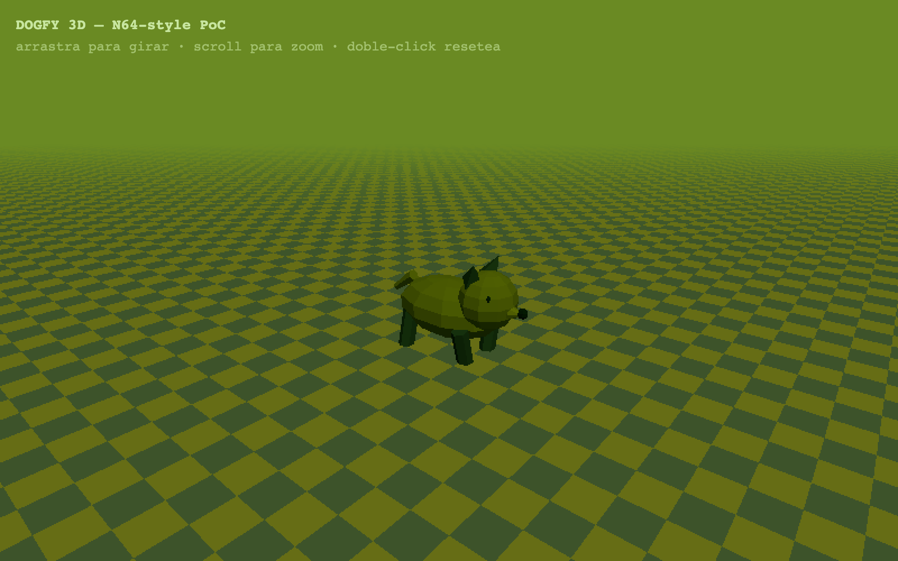
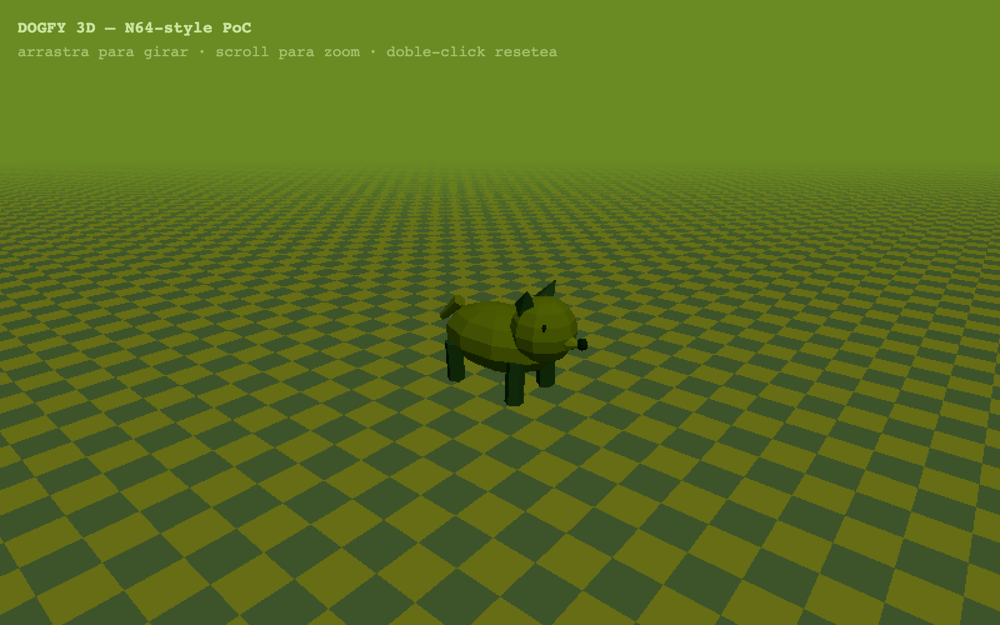

<div align="center">
  
</div>

# 🐕 Dogfy 3D

**Un perrito low-poly con sabor a cartucho de Nintendo 64, modelado entero a base de geometría procedural.**

[](https://gavilanbe.github.io/dogfy-3d/)


---

## Qué es esto

Una prueba de concepto con estética **Nintendo 64**: un perrito construido íntegramente con primitivas de Three.js (esferas, cilindros y conos), unos ~200 polígonos en total, para validar el look 3D retro antes de dar el salto a un cartucho de verdad.

Sin antialiasing, `pixelRatio` a 1 y niebla a media distancia para clavar el aire de aquellas consolas. El perro tiene una animación idle: rebota suavemente, mueve las patas como si corriera en el sitio y agita el rabo. Todo dentro de la misma paleta verde DMG que conecta con el resto del universo Dogfy.

## 🎮 Cómo se juega

No hay objetivo: es un visor 3D para girar el modelo y admirar el sombreado plano.

| Acción | Control |
|---|---|
| Girar la cámara | Arrastrar con el ratón |
| Zoom | Rueda del ratón |
| Resetear la cámara | Doble clic |

## 📸 Capturas

| | |
|---|---|
|  |  |

## ▶️ Jugar

Juégalo directamente en el navegador: **[gavilanbe.github.io/dogfy-3d](https://gavilanbe.github.io/dogfy-3d/)**

O en local, sin instalar nada:

```bash
python3 -m http.server 8000
# luego abre http://localhost:8000
```

## 🛠️ Bajo el capó

- **Three.js r160** vía CDN (import map), sin build ni dependencias instaladas.
- `OrbitControls` para la cámara orbital con damping.
- Geometría 100% procedural: el perro y el suelo se generan por código, sin modelos externos.
- Suelo con textura dibujada en un canvas 64x64 y filtrado `NearestFilter` para que se vea bien pixelada.
- `MeshLambertMaterial` con `flatShading` para el sombreado facetado clásico.
- Niebla `THREE.Fog` y luz cálida + relleno frío para el contraste N64.

## 📦 Créditos

Publicado por [@gavilanbe](https://github.com/gavilanbe). Uno más de mi colección de juegos hechos por hobby. 🎮

## 📄 Licencia

[MIT](LICENSE)
